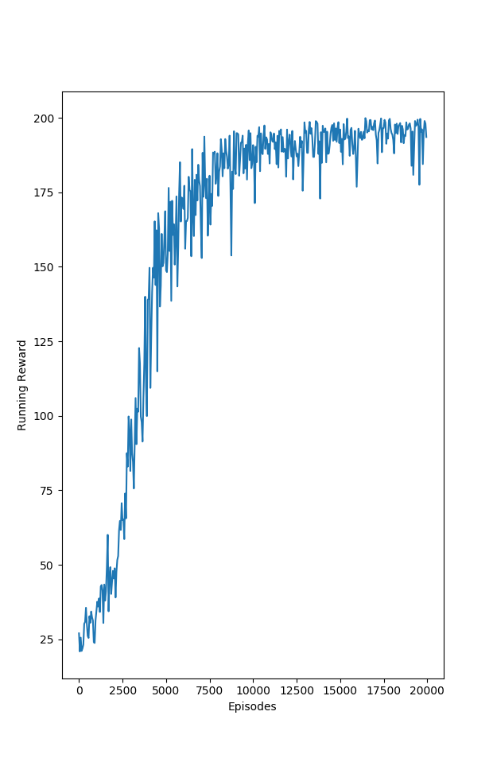

Policy Gradient algorithms implemented in pytorch. All algorithms use cartpole game for performance evaluation.

## REINFORCE
Trained for 20000 episodes 

## Advantage Actor Critic(A2C)
Trained for 20000 episodes. Implemented the unbiased and lower variance technique. Refer page 21 in these [slides](http://rll.berkeley.edu/deeprlcourse/f17docs/lecture_5_actor_critic_pdf.pdf) 

